# Guard网络验证平台
Guard是一个用来网络验证、卡密验证的平台.
- 加密方式采用RSA的加密方式。
- 支持代理端
- 支持HTTP和Socket
- 支持定制化功能
- 支持全语言一键调用库  
需要的老板可以直接找我要demo体验
# 项目演示
[BV19tCoYAESL](https://www.bilibili.com/video/BV19tCoYAESL/)
# 网站截图
仪表盘
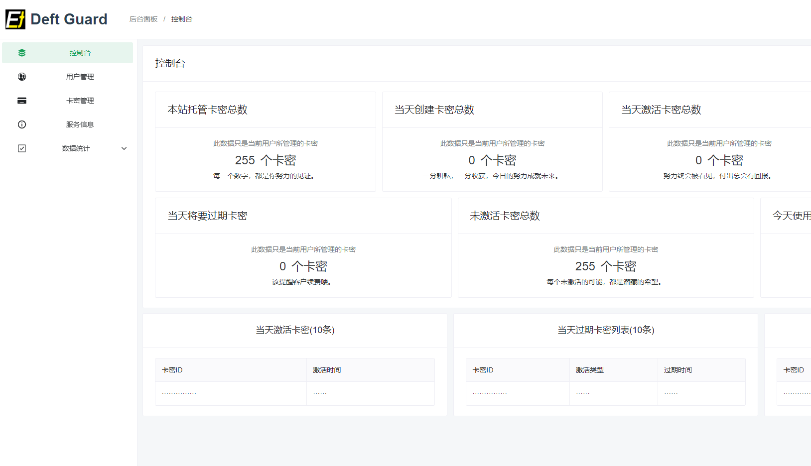
用户管理
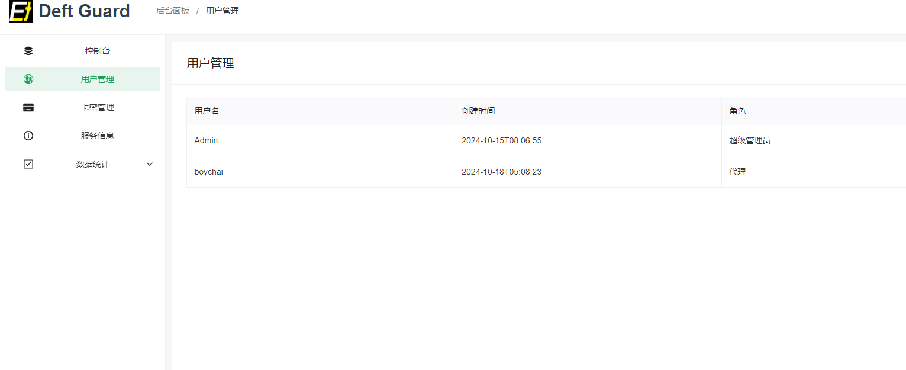
卡密页
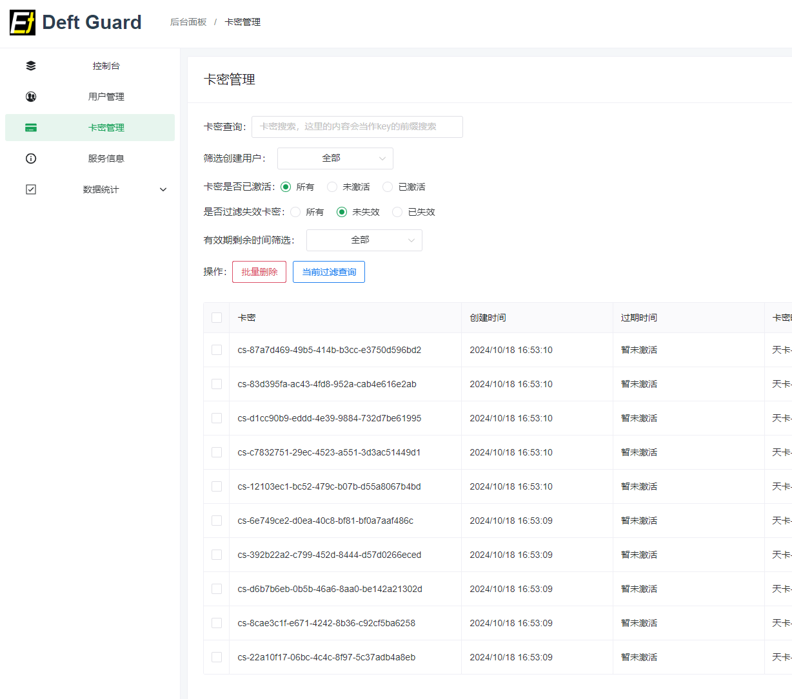
创建页
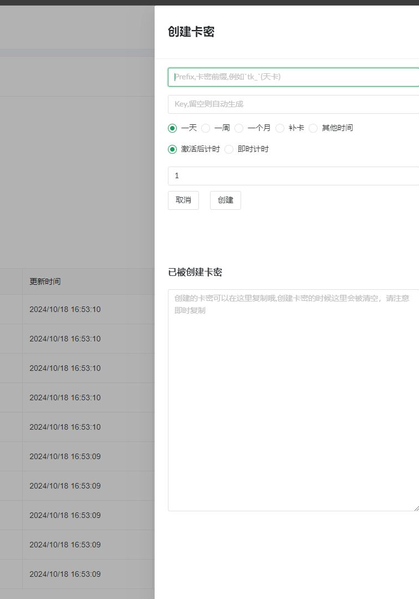
信息页
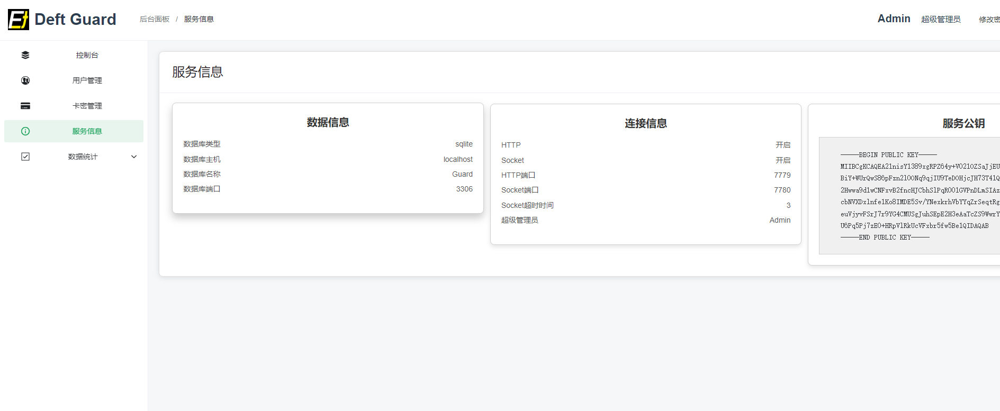
代理卡密页
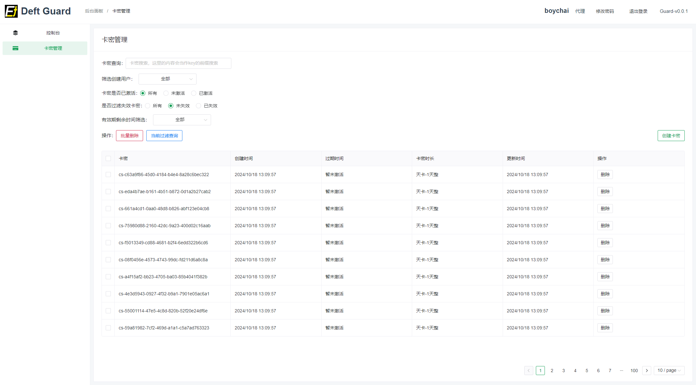
代理控制台
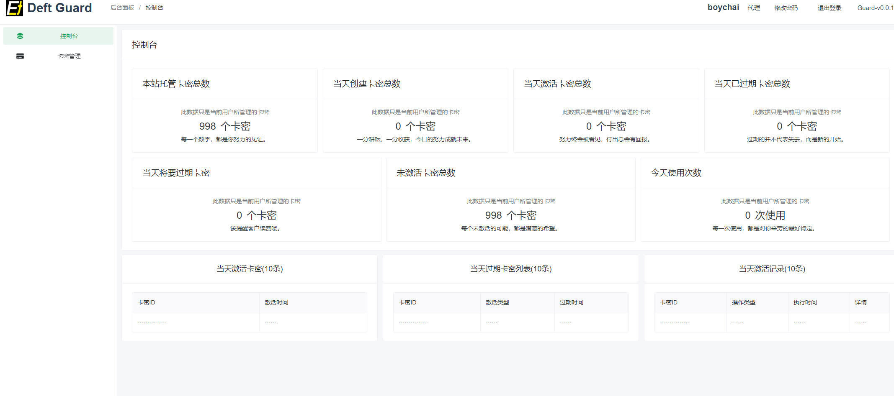
仪表2
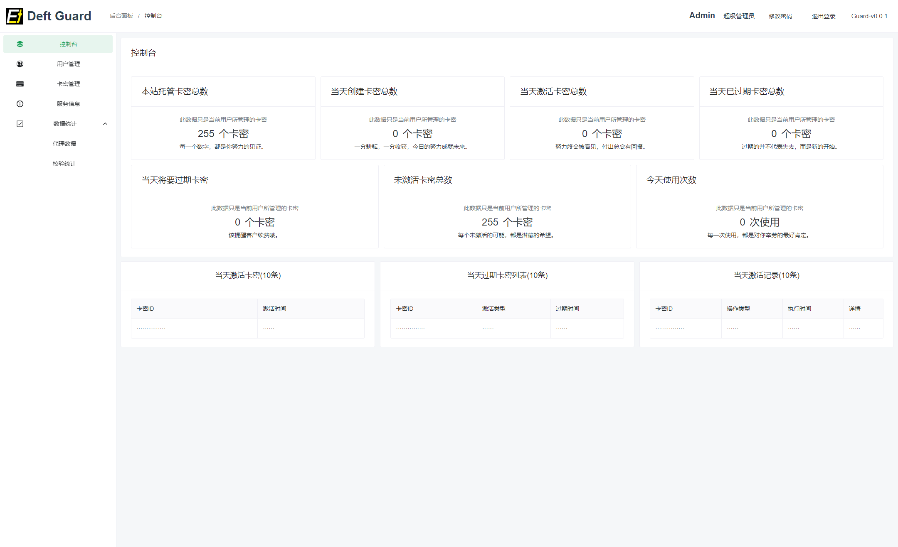
用户2
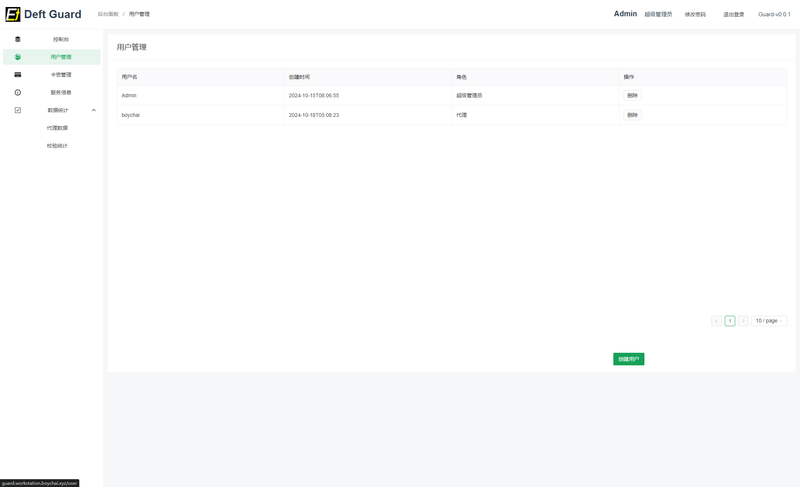
卡密2
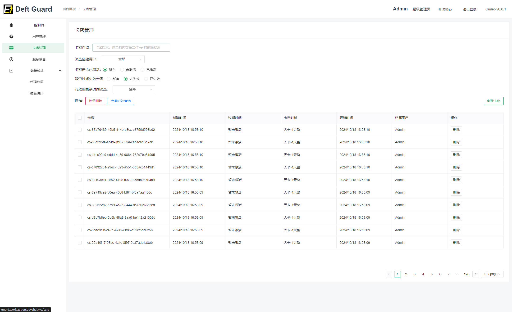
服务信息页2
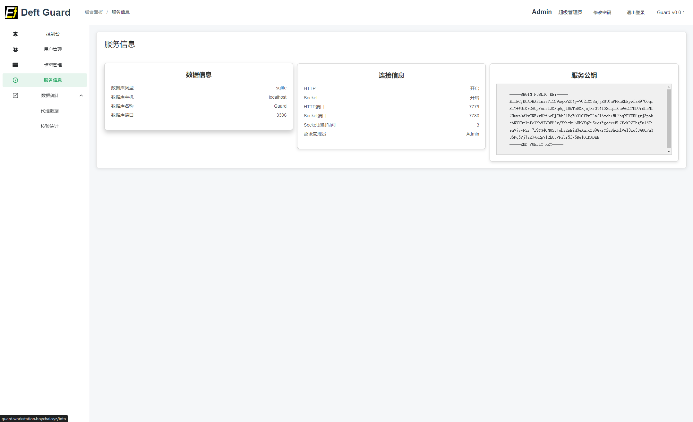
